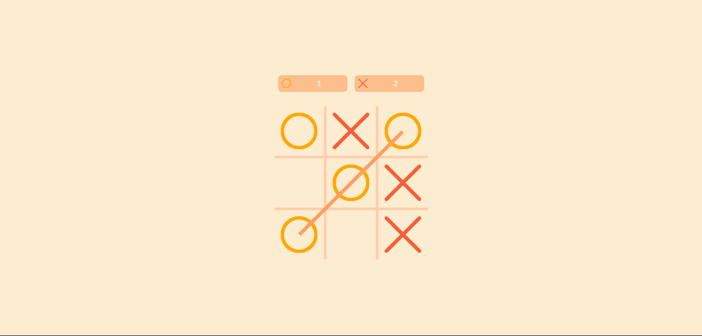
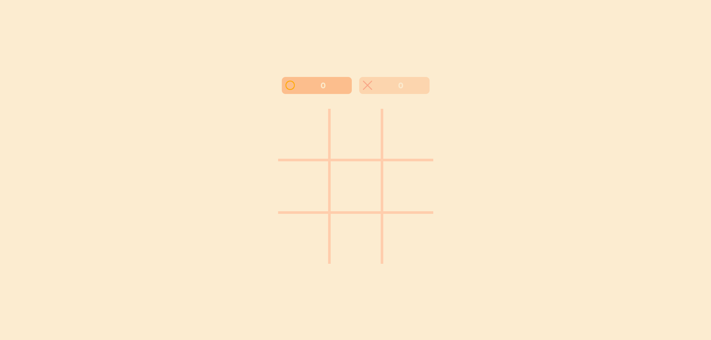
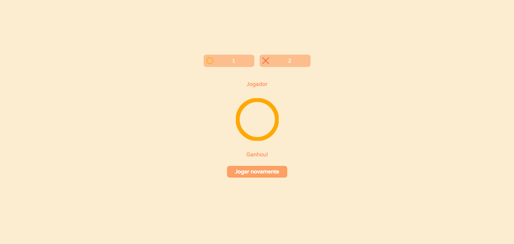

# 🎮 Jogo da Velha

Este é um Jogo da Velha simples para 2 jogadores 🤝, desenvolvido com HTML, CSS e JavaScript 💻. Com design minimalista 🎨 e fácil de jogar 🕹️.

## Como jogar em 3 passos.
1. Baixe o codigo e abra o arquivo index.html em seu navegador 💻.
2. Clique em uma célula vazia para marcar seu movimento.
3. O jogador com três marcas consecutivas ganha o jogo 🎉.

## 📷 Capturas de Tela

## Como contribuir
Este projeto é open-source e todos estão convidados a contribuir com melhorias ou correções. Siga os seguintes passos para fazer uma contribuição:

1. Faça o fork deste repositório 🍴.
2. Crie uma branch para sua contribuição 🌱.
3. Envie suas alterações para a branch criada 🚀.
4. Crie um Pull Request para que suas alterações sejam revisadas e mergeadas.
